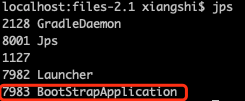
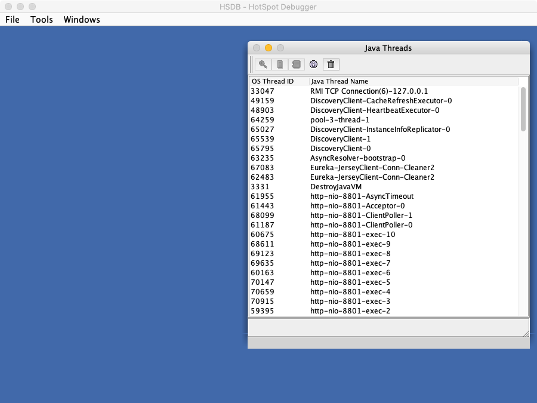
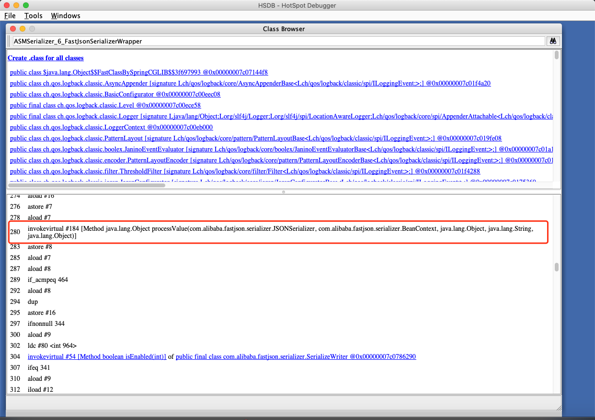
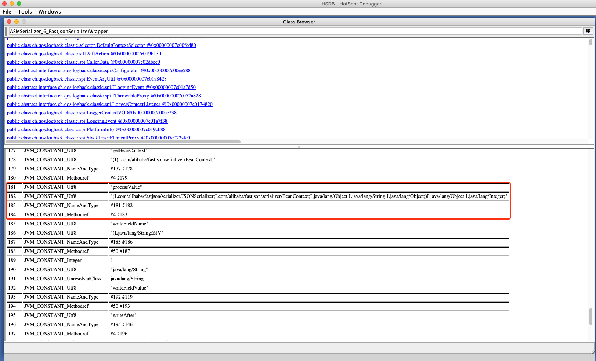

fastjson作为一个轻量级的java序列化类库，其最大的优势就是快，因此也被国内各个中小型公司大量的使用。但它也有不少短板，如可定制性低、API不够丰富、代码质量及文档缺失等一些列问题一直被人所诟病。

本次我们碰到的问题就是由fastjson的一个简单bug而引起的一连串研究。
<!-- more -->
## 发现bug
某日一位同学在调试新需求的时候发现如下错误日志：
``` java
Exception in thread "collection-eventbus-thread-1" java.lang.NoSuchMethodError: com.alibaba.fastjson.serializer.JavaBeanSerializer.processValue(Lcom/alibaba/fastjson/serializer/JSONSerializer;Lcom/alibaba/fastjson/serializer/BeanContext;Ljava/lang/Object;Ljava/lang/String;Ljava/lang/Object;)Ljava/lang/Object;Ljava/lang/Integer;
	at com.alibaba.fastjson.serializer.ASMSerializer_6_FastJsonSerializerWrapper.writeNormal(Unknown Source)
	at com.alibaba.fastjson.serializer.ASMSerializer_6_FastJsonSerializerWrapper.write(Unknown Source)
	at com.alibaba.fastjson.serializer.JSONSerializer.write(JSONSerializer.java:285)
	at com.alibaba.fastjson.JSON.toJSONString(JSON.java:663)
	at com.alibaba.fastjson.JSON.toJSONString(JSON.java:652)
	at com.oriente.cache.layeringCache.serializer.FastJsonRedisSerializer.serialize(FastJsonRedisSerializer.java:37)
	at org.springframework.data.redis.core.AbstractOperations.rawValue(AbstractOperations.java:117)
	at org.springframework.data.redis.core.DefaultValueOperations.multiSet(DefaultValueOperations.java:136)
	at com.oriente.collection.event.listener.RedisEventListener.schedule(RedisEventListener.java:75)
	at sun.reflect.NativeMethodAccessorImpl.invoke0(Native Method)
	at sun.reflect.NativeMethodAccessorImpl.invoke(NativeMethodAccessorImpl.java:62)
	at sun.reflect.DelegatingMethodAccessorImpl.invoke(DelegatingMethodAccessorImpl.java:43)
	at java.lang.reflect.Method.invoke(Method.java:498)
	at com.google.common.eventbus.Subscriber.invokeSubscriberMethod(Subscriber.java:87)
	at com.google.common.eventbus.Subscriber$SynchronizedSubscriber.invokeSubscriberMethod(Subscriber.java:144)
	at com.google.common.eventbus.Subscriber$1.run(Subscriber.java:72)
	at java.util.concurrent.ThreadPoolExecutor.runWorker(ThreadPoolExecutor.java:1149)
	at java.util.concurrent.ThreadPoolExecutor$Worker.run(ThreadPoolExecutor.java:624)
	at java.lang.Thread.run(Thread.java:748)
```

通过观察错误，很快就能定位到是fastjson序列化的时候出现了错误。同时我们也确认的代码，在自定的RedisTemplate中，针对Value的序列化工具我们的确使用了fastjson的序列化方式。

- RedisTemplate使用自定义的fastjoson序列化工具
``` java
        FastJsonRedisSerializer<Object> fastJsonRedisSerializer = new FastJsonRedisSerializer<>(Object.class);

        redisTemplate.setValueSerializer(fastJsonRedisSerializer);
```

- FastJsonRedisSerializer中使用fastjson的API对统一包装类进行序列化
``` java
    @Override
    public byte[] serialize(T t) throws SerializationException {
        try {
            return JSON.toJSONString(new FastJsonSerializerWrapper(t), SerializerFeature.WriteClassName).getBytes(DEFAULT_CHARSET);
        } catch (Exception e) {
            throw new SerializationException(String.format("FastJsonRedisSerializer 序列化异常: %s, 【JSON：%s】",
                    e.getMessage(), JSON.toJSONString(t)), e);

        }
    }
```

## 分析bug
经过上面的一顿排查，问题已经很明确定位到是fastjson上了，并且错误信息给的相当明确：

  <font color=red> ` java.lang.NoSuchMethodError: com.alibaba.fastjson.serializer.JavaBeanSerializer.processValue(Lcom/alibaba/fastjson/serializer/JSONSerializer;Lcom/alibaba/fastjson/serializer/BeanContext;Ljava/lang/Object;Ljava/lang/String;Ljava/lang/Object;)Ljava/lang/Object;Ljava/lang/Integer; ` </font>

提示未找到JavaBeanSerializer.processValue方法。ok我们立马查询JavaBeanSerializer源码，发现processalue方法是继承自SerializeFilterable类：
> 方法清单：com.alibaba.fastjson.serializer.JavaBeanSerializer
``` java
    protected Object processValue(JSONSerializer jsonBeanDeser, //
                               BeanContext beanContext,
                               Object object, //
                               String key, //
                               Object propertyValue, //
                               int features) {
```

乍一看方法是存在的，这是我们又回到了错误本身。仔细查看错误，错误中提示我们processValue方法签名如下：

入参：
1. Lcom/alibaba/fastjson/serializer/JSONSerializer <font color=green>--JSONSerializer类型的对象</font>
2. Lcom/alibaba/fastjson/serializer/BeanContext <font color=green>--BeanContext类型的对象</font>
3. Ljava/lang/Object <font color=green>--Object对象</font>
4. Ljava/lang/String <font color=green>--String 类型</font>
5. Ljava/lang/Object <font color=green>--Object对象</font>

返回参数：
1. Ljava/lang/Object;Ljava/lang/Integer; <font color=green>--这是什么鬼？java的返回参数应该是不支持两个才对啊！</font>

经过对比，果然方法签名不一致。源码中SerializeFilterable.processValue()方法中有6个入参，而错误日志中提示的只有5个入参。缺少了最后一个 <font color=blue> int features</font>

#### 问题1
从方法签名的对比我们可以发现，该错误的确是因为找不对对应的方法所导致的。由于fastjson序列化的对象是通过ASM动态生成字节码产生的，我们可以通多源码或者借助工具来验证这个bug的真实性。
##### 1.代码验证
fastjson在java平台下会默认使用ASM的方式动态生成序列化代理类
> 方法清单：com.alibaba.fastjson.serializer.SerializeConfig
``` java
private boolean                                       asm             = !ASMUtils.IS_ANDROID;
```
> 方法清单：com.alibaba.fastjson.serializer.SerializeConfig
``` java
if (asm) {
    try {
        ObjectSerializer asmSerializer = createASMSerializer(beanInfo);
        if (asmSerializer != null) {
            return asmSerializer;
        }
    } catch (ClassNotFoundException ex) {
        // skip
    } catch (ClassFormatError e) {
        // skip
    } catch (ClassCastException e) {
        // skip
    } catch (OutOfMemoryError e) {
        if (e.getMessage().indexOf("Metaspace") != -1) {
            throw e;
        }
        // skip
    } catch (Throwable e) {
        throw new JSONException("create asm serializer error, verson " + JSON.VERSION + ", class " + clazz, e);
    }
}
```

> 方法清单：com.alibaba.fastjson.serializer.ASMSerializerFactory
``` java
private void _processValue(MethodVisitor mw, FieldInfo fieldInfo, Context context, Label _end) {
...
        mw.visitMethodInsn(INVOKEVIRTUAL, JavaBeanSerializer, "processValue",
                           "(L" + JSONSerializer  + ";" //
                                                                          + desc(BeanContext.class) //
                                                                          + "Ljava/lang/Object;Ljava/lang/String;" //
                                                                          + valueDesc + ")Ljava/lang/Object;Ljava/lang/Integer;");

                                                                          ...
}
```
通过上述源码，可以发现在通过ASM生成processValue方法签名时，只定义了5个参数。同时也能看到返回参数多设置了个Ljava/lang/Integer类型。

依赖代码阅读，我们已经可以确定错误代码的位置了。但由于毕竟是通过ASM动态字节码生成的类和对象，实际在JVM中的类是否也像我们现在看到的一样的话，我们就需要借助其他工具来帮助我们观察了。

##### 2.通过HSDB观察JVM中的类
* 已Debug模式启动Java服务
* 将断点设置到代理类生产逻辑后
> 方法清单：com.alibaba.fastjson.serializer.ASMSerializerFactory
``` java
//将动态生成的字节码对象装维字节数组
byte[] code = cw.toByteArray();
//动态加载类
Class<?> serializerClass = classLoader.defineClassPublic(classNameFull, code, 0, code.length);
```


* 打开HSDB
``` shell
java -cp sa-jdi.jar sun.jvm.hotspot.HSDB
```

* 获取当前java进程



* HSDB attach当前java进程




* 执行方法至断点处后，在HSDB搜索代理类



通过观察FastJsonSerializerWrapper.writeNormal()方法的字节码也可以发现，在调用processValue()方法的时候缺少了一个参数。

* 查看FastJsonSerializerWrapper的常量池



查看常量池中的内容，也再次确认了processValue()方法的签名存在问题：入参不对、返回参数也有问题。


#### 问题2
ASMSerializer_6_FastJsonSerializerWrapper.processValue()方法的返回值有两个。这会带来什么问题？为什么在类动态加载的时候JVM没有检查出方法签名的问题?

预知大道，必先为史。java也一样，java的历史就是JVM。要想了解动态加载类的时候到底做了什么，我们就必须参阅JVM源码。

之前阅读fastjson源码的时候，我们曾经来到这么一段代码。


显然源码是通过调用native方法，将类的字节流写入到JVM中的。jdk为开发者提供了丰富的类加载机制，但究其源还是依赖了这三个native方法，并且这三个方法仅仅是入参不同，其背后的实现原理其实是一样的。
> 方法清单：java.lang.ClassLoader
``` java
    private native Class<?> defineClass0(String name, byte[] b, int off, int len,
                                         ProtectionDomain pd);

    private native Class<?> defineClass1(String name, byte[] b, int off, int len,
                                         ProtectionDomain pd, String source);

    private native Class<?> defineClass2(String name, java.nio.ByteBuffer b,
                                         int off, int len, ProtectionDomain pd,
                                         String source);
```

###### java native 方法入口
按照jni的定义规范，native方法会按照以下的格式进行定义：
__JNIEXPORT jclass JNICALL Java_packagepath(包路径已_分割)_方法名__

根据上面的规定，我们很快就能还原出defineClass1方法在jdk中的定义：
<font color=blue> JNIEXPORT jclass JNICALL Java_java_lang_ClassLoader_defineClass1</font>

>代码清单：src/share/native/java/lang/ClassLoader.c
``` C++
JNIEXPORT jclass JNICALL
Java_java_lang_ClassLoader_defineClass1(JNIEnv *env,
                                        jobject loader,
                                        jstring name,
                                        jbyteArray data,
                                        jint offset,
                                        jint length,
                                        jobject pd,
                                        jstring source)
{
    jbyte *body;
    char *utfName;
    jclass result = 0;
    char buf[128];
    char* utfSource;
    char sourceBuf[1024];

    if (data == NULL) {
        JNU_ThrowNullPointerException(env, 0);
        return 0;
    }

    /* Work around 4153825. malloc crashes on Solaris when passed a
     * negative size.
     */
    if (length < 0) {
        JNU_ThrowArrayIndexOutOfBoundsException(env, 0);
        return 0;
    }

    body = (jbyte *)malloc(length);

    if (body == 0) {
        JNU_ThrowOutOfMemoryError(env, 0);
        return 0;
    }

    (*env)->GetByteArrayRegion(env, data, offset, length, body);

    if ((*env)->ExceptionOccurred(env))
        goto free_body;

    if (name != NULL) {
        utfName = getUTF(env, name, buf, sizeof(buf));
        if (utfName == NULL) {
            JNU_ThrowOutOfMemoryError(env, NULL);
            goto free_body;
        }
        VerifyFixClassname(utfName);
    } else {
        utfName = NULL;
    }

    if (source != NULL) {
        utfSource = getUTF(env, source, sourceBuf, sizeof(sourceBuf));
        if (utfSource == NULL) {
            JNU_ThrowOutOfMemoryError(env, NULL);
            goto free_utfName;
        }
    } else {
        utfSource = NULL;
    }
    result = JVM_DefineClassWithSource(env, utfName, loader, body, length, pd, utfSource);

    if (utfSource && utfSource != sourceBuf)
        free(utfSource);

 free_utfName:
    if (utfName && utfName != buf)
        free(utfName);

 free_body:
    free(body);
    return result;
}
```

代码中调用了JVM_DefineClassWithSource方法，该方法定义在JVM源码中，下载JVM源码搜索该方法。
> 代码清单：src/share/vm/prims/jvm.cpp
``` C++
JVM_ENTRY(jclass, JVM_DefineClassWithSource(JNIEnv *env, const char *name, jobject loader, const jbyte *buf, jsize len, jobject pd, const char *source))
  JVMWrapper2("JVM_DefineClassWithSource %s", name);

  return jvm_define_class_common(env, name, loader, buf, len, pd, source, true, THREAD);
JVM_END
```
经过一连串的内部调用,JVM才开始真正解析字节码流：
> src/share/vm/prims/jvm.cpp --> JVM_DefineClassWithSource()
>> src/share/vm/prims/jvm.cpp --> jvm_define_class_common()
>>> src/share/vm/classfile/systemDictionary.cpp --> Klass* SystemDictionary::resolve_from_stream()
>>>> src/share/vm/classfile/classFileParser.cpp --> instanceKlassHandle ClassFileParser::parseClassFile()


JVM首先会判断是否需要进行格式校验
> 代码清单：src/share/vm/classfile/classFileParser.cpp
``` C++
  // Figure out whether we can skip format checking (matching classic VM behavior)
  if (DumpSharedSpaces) {
    // verify == true means it's a 'remote' class (i.e., non-boot class)
    // Verification decision is based on BytecodeVerificationRemote flag
    // for those classes.
    _need_verify = (verify) ? BytecodeVerificationRemote :
                              BytecodeVerificationLocal;
  } else {
    _need_verify = Verifier::should_verify_for(class_loader(), verify);
  }
```
DumpSharedSpaces默认为false，因此会走到下面的分支

> 代码清单：src/share/vm/classfile/verifier.cpp
``` C++
bool Verifier::should_verify_for(oop class_loader, bool should_verify_class) {
  return (class_loader == NULL || !should_verify_class) ?
    BytecodeVerificationLocal : BytecodeVerificationRemote;
}
```

当前class_loader为当前classLoad，并且should_verify_class在调用jvm_define_class_common方法时传值true
> 代码清单：src/share/vm/prims/jvm.cpp
``` C++
JVM_ENTRY(jclass, JVM_DefineClassWithSource(JNIEnv *env, const char *name, jobject loader, const jbyte *buf, jsize len, jobject pd, const char *source))
  JVMWrapper2("JVM_DefineClassWithSource %s", name);

  return jvm_define_class_common(env, name, loader, buf, len, pd, source, true, THREAD);
JVM_END
```

因此判断_need_verify的结果最终落到了BytecodeVerificationRemote上。

我们先看BytecodeVerificationRemote在jvm里的定义：
> 代码清单：src/share/vm/runtime/globals.hpp
``` C++
  product(bool, BytecodeVerificationRemote, true,                           \
          "Enable the Java bytecode verifier for remote classes")           \
```
可见BytecodeVerificationRemote在JVM初始化的时候默认值为true，代表非JVM自己的对象在加载的时候需要进行各种校验。

为了证明这点，我们再看看解析方法时具体的逻辑：
> 代码清单：src/share/vm/classfile/classFileParser.cpp --> methodHandle ClassFileParser::parse_method()
``` C++
  if (_need_verify) {
    args_size = ((flags & JVM_ACC_STATIC) ? 0 : 1) +
                 verify_legal_method_signature(name, signature, CHECK_(nullHandle));
    if (args_size > MAX_ARGS_SIZE) {
      classfile_parse_error("Too many arguments in method signature in class file %s", CHECK_(nullHandle));
    }
  }
```

JVM在解析方法的逻辑中，会先对方法的合法性做各种校验。其中就有对方法签名的校验。如果_need_verify为false，则改校验会被跳过。

通过上面的一连串的代码分析，我们得到了BytecodeVerificationRemote的值最终会影响Fastjson通过ASM动态字节码生成的类文件的解析。

接下来我们搞明白BytecodeVerificationRemote的值是如何被更改的，老样子代码一顿乱搜：
> 代码清单：src/share/vm/runtime/arguments.cpp --> jint Arguments::parse_each_vm_init_arg
``` C++
// -Xverify
    } else if (match_option(option, "-Xverify", &tail)) {
      if (strcmp(tail, ":all") == 0 || strcmp(tail, "") == 0) {
        FLAG_SET_CMDLINE(bool, BytecodeVerificationLocal, true);
        FLAG_SET_CMDLINE(bool, BytecodeVerificationRemote, true);
      } else if (strcmp(tail, ":remote") == 0) {
        FLAG_SET_CMDLINE(bool, BytecodeVerificationLocal, false);
        FLAG_SET_CMDLINE(bool, BytecodeVerificationRemote, true);
      } else if (strcmp(tail, ":none") == 0) {
        FLAG_SET_CMDLINE(bool, BytecodeVerificationLocal, false);
        FLAG_SET_CMDLINE(bool, BytecodeVerificationRemote, false);
      } else if (is_bad_option(option, args->ignoreUnrecognized, "verification")) {
        return JNI_EINVAL;
      }
```

| Xverify | BytecodeVerificationLocal | BytecodeVerificationRemote |
| ------ | ------ | ------ |
| all 或 不传 | true | true |
| remote | false | true |
| none | false | false |

顺着这个思路我们再看看服务启动时的参数。由于是采用IDEA启动的springboot项目，我们没有手动指定各种启动参数。老样子我们还是借助其他工具进行查看。这次我们使用jdk自带的VisualVM。


这回事真相大白了，通过IDEA默认启动springboot项目时，会默认带上<font color=red>-Xverify:none</font>参数。结合我们上面对JVM源码的分析，在Xverify==none时。加载类模板时不会对类结构的合法性进行校验，这也最终导致了为什么方法签名明明不正确，但是JVM还是成功的加载了这个类。

至于为什么IDEA启动的时候会带上<font color=red>-Xverify:none</font>参数，我们可以参考官网的一句话。
> https://www.jetbrains.com/help/idea/run-debug-configuration-spring-boot.html#configuration-tab


## 总结
至此，整个fastjson序列化引起的异常已经排查完了。

回顾整个排查过程其实这一个错误引出了两个问题。
* 第一个问题是fastjson通过ASM生成字节码文件的时候，processValue的参数个数不对。fastjson官方在后续版本中增加了processValue的重载方法，从而修复这个问题。
* 第二个问题是processValue方法的方法签名不正确，方法返回类型写有两个参数。从而引起对JVM解析类时，方法签名合法性校验机制的研究。官方也在后续版本中修正了方法签名的错误。

以上，虽然这次问题的发现和解决都很简单。但是牵扯出了一部分JVM源码的知识，借由这次机会，加深相关知识。

