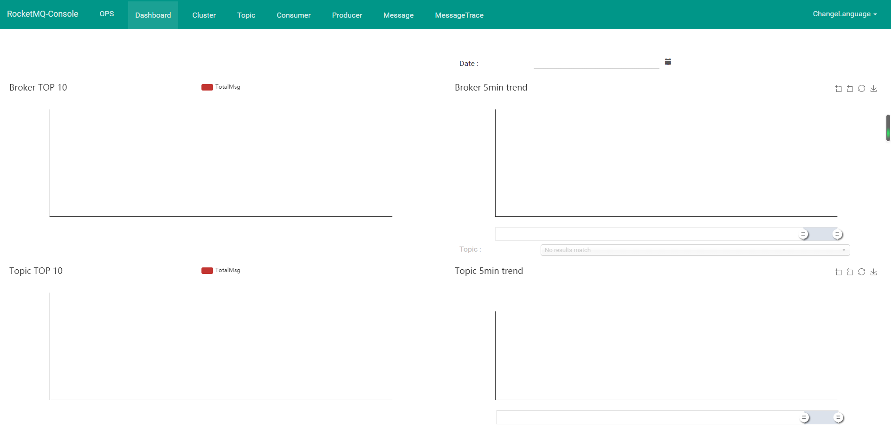
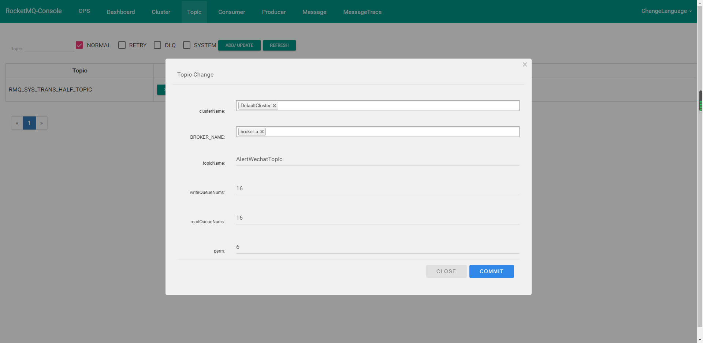
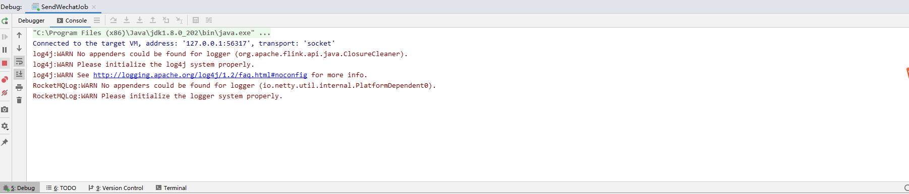
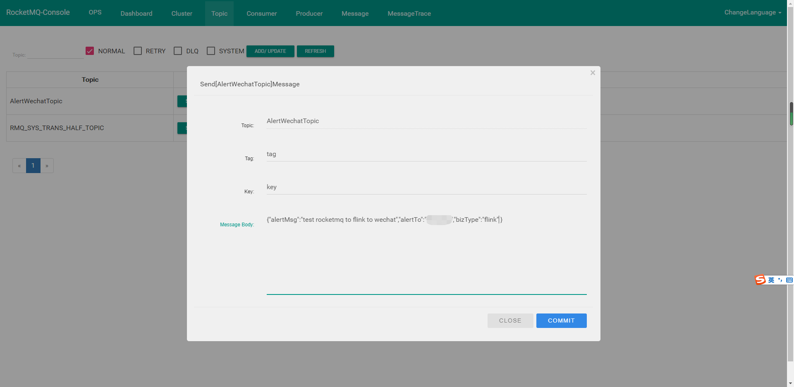
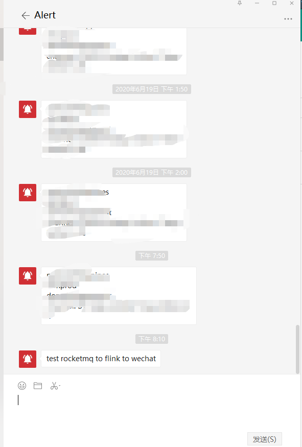

上次我们简单的实现了如何通过Flink实现一个简单的wechat推送功能，这次我们就实际的运行起来看看。以下操作都是基于windows环境，为避免环境的影响全部采用docker部署。

### 搭建本地RocketMQ环境
1. 拉取namesrv 和broker 镜像
   - docker pull rocketmqinc/rocketmq:4.4.0

2. 启动namesrv
   - docker run -d -p 9876:9876 -v D:\work\rocketmq\data\namesrv\logs:/root/logs -v D:\work\rocketmq\data\namesrv\store:/root/store --name rmqnamesrv -e "MAX_POSSIBLE_HEAP=100000000" rocketmqinc/rocketmq:4.4.0 sh mqnamesrv

3. 配置broker.config
   ``` yml
    brokerClusterName = DefaultCluster
    brokerName = broker-a
    brokerId = 0
    deleteWhen = 04
    fileReservedTime = 48
    brokerRole = ASYNC_MASTER
    flushDiskType = ASYNC_FLUSH
    brokerIP1 = 192.168.1.2
   ```
  <!-- more -->
4. 启动broker
   - docker run -d -p 10911:10911 -p 10909:10909 -v  D:\work\rocketmq\data\broker\logs:/root/logs -v  D:\work\rocketmq\data\broker\store:/root/store -v  D:\work\rocketmq\conf\broker.conf:/opt/rocketmq-4.4.0/conf/broker.conf --name rmqbroker --link rmqnamesrv:namesrv -e "NAMESRV_ADDR=namesrv:9876" -e "MAX_POSSIBLE_HEAP=200000000" rocketmqinc/rocketmq:4.4.0 sh mqbroker -c /opt/rocketmq-4.4.0/conf/broker.conf

5. 拉取控制台镜像
   - docker pull pangliang/rocketmq-console-ng

6. 启动控制台
   - docker run -e "JAVA_OPTS=-Drocketmq.namesrv.addr=192.168.1.2:9876 -Dcom.rocketmq.sendMessageWithVIPChannel=false" -p 8080:8080 -t pangliang/rocketmq-console-ng

### RocketMQ 设置
以上，我们就在本地环境简单的部署好了rocketMQ的运行环境



我们配置下Topic



### 启动Flink本地运行时环境
1. 配置启动参数

--nameserverAddress 127.0.0.1:9876 --consumerGroup flinkGroup --consumerTopic AlertWechatTopic

2. 启动Flink本地运行时Job
   


3. 模拟一条报警信息



4. 查看报警信息




### 总结
通过简单的操作，我们就可以定义一套统一的wechat告警信息发送机制。业务系统、告警系统、或是Flink其他的Job不需要关心告警推送的细节。只要向统一的Topic中推送告警信息，告警推送任务就是实时的把错误信息推送至wechat中。
接下来，我们将围绕告警的核心功能：数据的采集、数据的分析。基于Flink来设计一个统一的报警平台。