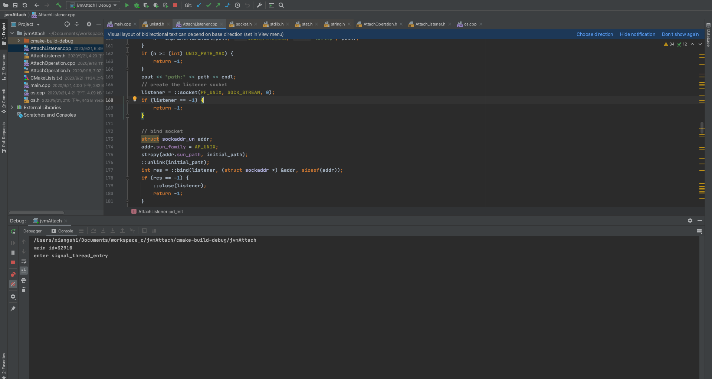
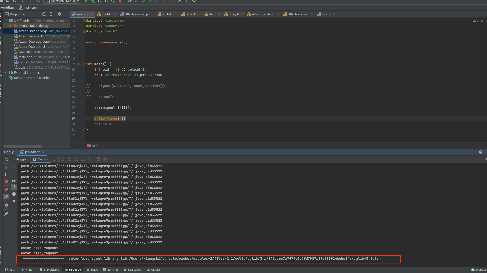
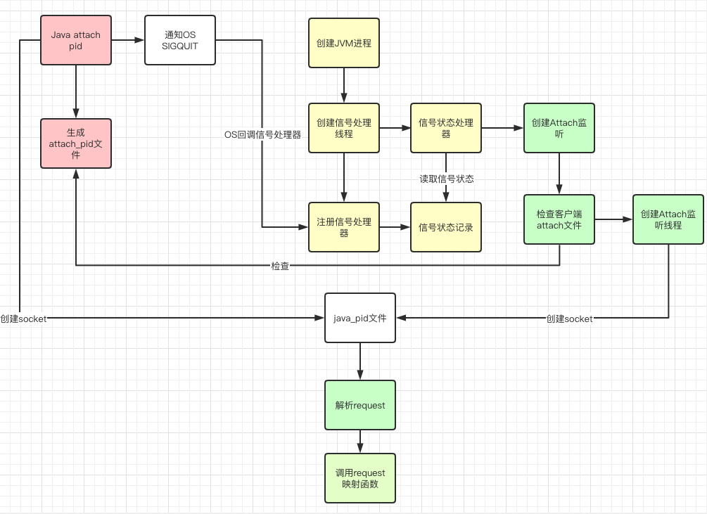

相信很多小伙伴都使用过javaagent探针技术，javaagent可以在不侵入原代码不的前提下，通过指定方法并利用动态字节码技术增强我们的代码。很多成熟的框架也运用到了该技术，如skywalking等。这么好用的功能，JDK的开发人员没道理不玩出些新花头，因此在JDK1.6中，更加强大的JVM 动态Attach技术展现在我们的面前。大名鼎鼎的Btrace、Arthas等都运用了动态Attach技术。在JVM运行期进拦截并增强我们的代码，使得以往生产难以定位的问题变得更加容易排查。
<!-- more -->
JVM的动态Attach固然好，相信大家或多或少已经知道如何去使用该技术了，所以这次我们研究的重点是JVM是如何实现动态Attach，至于JVM如何加载动态Jar包、分发方法并传递jvm上下文就不在我们的研究范围之内。

为了更好的研究JVM的实现，我们将由浅入深，分为几个阶段进行研究：
* 动态Attach是什么？
* 有几种方案可以实现动态Attach
* 举一个栗子
* 看看JVM是怎么做的

## 一、动态Attach是什么
虽然我们这次研究的是具体的实现，但在这之前，我们需要像分析需求一样分析下动态Attach到底是什么。

我们都知道javaagent参数是伴随着java命令，在JVM启动的过程中加载javaagent参数指定的Jar包路径，并执行约定类的premain方法。在premain方法中可以获取Instrumentation类型参数，从而对我们的类进行动态增强增强。

我们可以这样使用javaagent：
1. 先实现一个我们需要挂在的类，其中需要实现premain()方法，并将它打包为可执行Jar包
``` java
public class Javaagent {
    public static void premain(String agentArgs, Instrumentation inst) {
        System.out.println("agentArgs : " + agentArgs);
        inst.addTransformer(new TestTransformer(), true);
    }

    static class TestTransformer implements ClassFileTransformer {

        @Override
        public byte[] transform(ClassLoader loader, String className, Class<?> classBeingRedefined, ProtectionDomain protectionDomain, byte[] classfileBuffer) throws IllegalClassFormatException {
            System.out.println("premain load Class:" + className);
            return classfileBuffer;
        }
    }
}
```

2. 配置MANIFEST.MF配置文件
```xml
Premain-Class: Javaagent
Agent-Class: Javaagent
Can-Redefine-Classes: true
Can-Retransform-Classes: true
```

3. 启动我们的服务
```shell
java -javaagent:Javaagent.jar 自己的服务.jar
```

以上就是一个简单的javaagent运用场景。javaagent可以在不侵入业务代码的前提下修改我们已加载的类，但唯一的问题是需要伴随着业务服务一同启动。也就是说我们无法侵入已经运行在JVM中的代码，因此JDK开发的大神们为我们带来了动态Attach API。其功能与javaagent是一样的，但最大的好处就是我们能够在一个已经运行的JVM上动态的挂载一个我们自己开发的Jar包，从而实现任何时间点我们都能手动的增强业务代码。比如通过attach Arthas，我们能增强指定方法的入口&出口，从而获取出入参的相关信息。这在缺少日志输出的场景下是非常有效的问题定位手段。此外我们也能为方法的调用链做埋点，帮助我们分析业务流程中的慢方法等等。

总结下，动态Attach就是JVM运行期中提供的指定类型的类加载机制。通过增强类的加载，实现各式各样有趣的功能。

## 二、有几种方案可以实现动态Attach
现在我们已经知道什么是动态Attach了，倘若我们是JDK的工程师，当产品交给我们需要实现动态Attach这个需求时，我们会怎么实现呢？
#### 1.直接类加载法
JDK已经提供了一套完善的类加载机制，如果提供获取Instrumentation对象的JNI，开发人员就可以自行通过动态类加载后进行字节码动态增强。这个方案看似很美好，现有Java生态圈已经拥有丰富的Class动态加载方案，利用这些现有方案，开发人员能够很快的搭建出自己的字节码动态加载机制，而无需JVM提供大量的native支持。但是这个方案存在重大的安全问题，一旦服务的动态加载机制被黑客破解，那么他完全能够加载一个自己编写好的侵入类，通过入侵类任意修改业务代码最终导致无法挽回的损失。所以作为一个JDK开发工程师，一定要在初期就屏蔽这种安全问题。同时Java最为一种安全语言，不安全的操作需要尽量避免引入Java生态中。
#### 2.Socket通信法
既然提供JNI不安全，那么我们是否可以考虑让JVM自己处理。假设我们能和JVM建立起Socket通讯。并将我们希望加载的类告知JVM，JVM在加载完成后按照约定执行指定的入口方法，这样也能实现我们对动态Attach的实现。

Socket通信可以分为远程通信和本地通信。我们需要考虑，如果采用远程通信，的确能给我们带来更强大的Attach灵活性，但需要JVM暴露端口，同样具有一定的安全问题。
本地通讯我们可以采用UNIX Domain Socket，通过文件形式通讯。不但具有较高的通信速度，同时具有一定的安全性。

如果采用Socket Local通信，那我们又如何与JVM建立起通信呢？
#### 3.信号监听法
其实这个方法是Socket通信法的补充。在与JVM建立起本地通信前，JVM需要知道用户想要开始动态Attach。而信号监听就能补充这方面的功能。客户端以约定的形式向JVM进程发起指定信号，同时JVM在监听到Attach信号后与客户端建立Socket链接。客户端以Socket方式将需要加载的类告知JVM并进行加载并最终运行我们后面熟悉的javaagent流程。

我虽然不是JDK的工程师，上面的3个方案也是结合了JDK1.8的具体实现后大胆的揣测了当时开发工程师的想法。可能当时摆在他面前的方案更是成千上万，但是最终确定下这个技术方案的心路历程我觉得是我们每个开发都需要感同身受的。

## 三、举一个栗子
前面我们分析了实现方案，我们先丢一份代码来验证上面的方案（代码为JDK1.8源码相关功能的简化版）

### 开始实验

<font color=blue>需求：</font>实现动态Attach API，接收java -jar xxx.jar pid发起的挂载请求，并将loadAgent指定的Jar包完整路径显示在控制台。

<font color=blue>实验环境：</font>MacOS 10.15.6

<font color=blue>项目地址：</font>
> https://github.com/xzenge/JVM_ATTACH/tree/dev

##### 我们先启动项目。该项目模拟了JVM运行环境，但只实现了Attach API的部分功能。项目启动成功后，我们可以看到当前的JVM进程ID为：<font color=red>32910</font>



----

##### 按照JDK规范编写JAVA测Attach方法。为了简便，方法中我们手动指定了attach的线程号，并提供了JVM需要加载的Jar包路径。

```java
public class Attach {
    public static void main(String[] args) throws IOException, AttachNotSupportedException, AgentLoadException, AgentInitializationException {
        VirtualMachine attach = VirtualMachine.attach("32910");
        attach.loadAgentPath("/Users/xiangshi/.gradle/caches/modules-2/files-2.1/cglib/cglib/3.1/1f1cb6c7a7479e0c7fd7987109e503914bebe84a/cglib-3.1.jar");


    }
}

```

----
##### 运行Java attach方法，我们可以观察到模拟的JVM已经读取到了我们希望classloader的Jar包



----

### 实验分析
实验过程很简单，我们伪造了个JVM运行时环境。并通过JAVA原生的Attach API成功的实现了与JVM之间通讯的功能。下面我们开始逐步分析具体的实现过程：

* 监听signal
初始化OS信号监听的相关数据

``` C++
/**
 * JVM启动时监听signal
 */
void os::signal_init() {
    //初始化signal监听pending_signals
    os::signal_init_pd();
    //创建线程监听pending_signals状态并进行相应处理
    pthread_t tids;
    int ret = pthread_create(&tids, NULL, reinterpret_cast<void *(*)(void *)>(signal_thread_entry), NULL);
    //注册signal处理器
    os::signal(SIGBREAK,os::user_handler());
}
```

sigaction方法提供os信号的监听并注册信号处理器，我们监听-3 SIGQUIT信号。

```C++
/**
 * 注册监听信号&处理器
 * @param signal_number 信号编号
 * @param handler 信号处理器
 * @return
 */
void *os::signal(int signal_number, void *handler) {
    struct sigaction sigAct, oldSigAct;

    sigfillset(&(sigAct.sa_mask));
    sigAct.sa_flags   = SA_RESTART|SA_SIGINFO;
    sigAct.sa_handler = CAST_TO_FN_PTR(sa_handler_t, handler);

    if (sigaction(signal_number, &sigAct, &oldSigAct)) {
        // -1 means registration failed
        return (void *)-1;
    }

    return CAST_FROM_FN_PTR(void*, oldSigAct.sa_handler);
}
```

信号处理器中简单的模拟的收到信号的处理过程，数组对应的信号位置为1时，说明收到了对应的信号。

```C++
/**
 * 通过pending_signals保留监听到的信息，交由专门的线程处理该信息
 * @param signal_number
 */
void os::signal_notify(int signal_number) {
    cout << "enter signal_notify sig:" << signal_number << endl;
    //将监听到的信号为竖为1
    //改操作应该为原子操作，确保不会被其他线程修改
    //JVM中混编平台相关汇编指令实现原子操作，演示代码中不研究相关实现
    pending_signals[signal_number] = 1;

    semaphore_signal(sig_sem);
}
```

单独起一个线程，该线程轮训信号接受数组的状态，将置为1的信号码传给下游处理。当信号位-3 SIGQUIT信号时，开始初始化attach的监听方法。

```C++
/**
 * 单独线程对pending_signals状态并进行相应处理
 */
static void signal_thread_entry() {
    cout << "enter signal_thread_entry" << endl;
    while (true){
        int sig;
        {
            sig = os::signal_wait();
        }
        switch (sig) {
            case SIGBREAK: {
                if (AttachListener::init()) {
                    continue;
                }
            }
        }

    }
}
```

初始化attach监听方法时，会创建一个Domain Socket的文件监听，并accept在改文件上。

```C++
/**
 * 初始化domain socket监听
 * JVM通过监听指定线程文件文件
 * 获取client想JVM发送的指令并进行相关操作
 * @return
 */
int AttachListener::pd_init() {
    char path[UNIX_PATH_MAX];          // socket file
    char initial_path[UNIX_PATH_MAX];  // socket file during setup
    int listener;                      // listener socket (file descriptor)

    // register function to cleanup
    ::atexit(listener_cleanup);

    int n = snprintf(path, UNIX_PATH_MAX, "%s/.java_pid%d",
                     TEMP_PATH, getpid());
    if (n < (int) UNIX_PATH_MAX) {
        n = snprintf(initial_path, UNIX_PATH_MAX, "%s.tmp", path);
    }
    if (n >= (int) UNIX_PATH_MAX) {
        return -1;
    }
    cout << "path:" << path << endl;
    // create the listener socket
    listener = ::socket(PF_UNIX, SOCK_STREAM, 0);
    if (listener == -1) {
        return -1;
    }

    // bind socket
    struct sockaddr_un addr;
    addr.sun_family = AF_UNIX;
    strcpy(addr.sun_path, initial_path);
    ::unlink(initial_path);
    int res = ::bind(listener, (struct sockaddr *) &addr, sizeof(addr));
    if (res == -1) {
        ::close(listener);
        return -1;
    }

    // put in listen mode, set permissions, and rename into place
    res = ::listen(listener, 5);
    if (res == 0) {
        RESTARTABLE(::chmod(initial_path, S_IREAD | S_IWRITE), res);
        if (res == 0) {
            if (res == 0) {
                res = ::rename(initial_path, path);
            }
        }
    }
    if (res == -1) {
        ::close(listener);
        ::unlink(initial_path);
        return -1;
    }
    set_path(path);
    set_listener(listener);

    return 0;
}
```

一旦收到java发送过来的socket请求，则解析该请求并包装为AttachOperation对象。

```C++
/**
 * accept domain socket，读取到内容后生成对应的AttachOperation
 * @return
 */
AttachOperation *AttachListener::dequeue() {
    for (;;) {
        int s;

        // wait for client to connect
        struct sockaddr addr;
        socklen_t len = sizeof(addr);
        RESTARTABLE(::accept(listener(), &addr, &len), s);
        if (s == -1) {
            return NULL;      // log a warning?
        }

        // get the credentials of the peer and check the effective uid/guid
        // - check with jeff on this.
        uid_t puid;
        gid_t pgid;
        if (::getpeereid(s, &puid, &pgid) != 0) {
            ::close(s);
            continue;
        }
        uid_t euid = geteuid();
        gid_t egid = getegid();

        //检查DS文件是否为同一个用户创建
        if (puid != euid || pgid != egid) {
            ::close(s);
            continue;
        }

        // 读取文件内容，生成AttachOperation对象
        AttachOperation *op = read_request(s);
        if (op == NULL) {
            ::close(s);
            continue;
        } else {
            return op;
        }
    }
}
```

最后用包装后的AttachOperation，通过函数指针调用已绑定的处理函数。

```C++
static void attach_listener_thread_entry() {
    int pdint = AttachListener::pd_init();
    if (pdint != 0) {
        return;
    }
    AttachListener::set_initialized();

    for (;;) {
        AttachOperation* op = AttachListener::dequeue();
        if (op == NULL) {
            return;   // dequeue failed or shutdown
        }

        // find the function to dispatch too
        AttachOperationFunctionInfo* info = NULL;
        for (int i=0; funcs[i].name != NULL; i++) {
            const char* name = funcs[i].name;
            if (strcmp(op->name(), name) == 0) {
                info = &(funcs[i]);
                break;
            }
        }

        if (info != NULL) {
            // dispatch to the function that implements this operation
            (info->func)(op);
        }
    }
}
```

<font color=red>总结</font> ，通过信号监听-->socket通信-->调用指定方法的流程，实现了我们实验的预期。

## 四、看看JVM是怎么做的
最后我们回到JVM内部，看看JVM是如何实现的。

由于实验代码大量的采用了JVM的实现，我们这里主要观察JVM的流程。

* JVM启动时会初始化信号的监听

> 代码清单：src/share/vm/runtime/thread.cpp

```C++
jint Threads::create_vm(JavaVMInitArgs* args, bool* canTryAgain) {
    ...

  // Signal Dispatcher needs to be started before VMInit event is posted
  os::signal_init();

  // Start Attach Listener if +StartAttachListener or it can't be started lazily
  if (!DisableAttachMechanism) {
    AttachListener::vm_start();
    if (StartAttachListener || AttachListener::init_at_startup()) {
      AttachListener::init();
    }
  }
    ...
}
```

os::signal_init();功能我们前面已经分析过，JVM会注册kill -3信号的监听和对应的信号处理器，同时会启动一个单独的线程对监听到的信号做后续业务处理。

<font color=blue>DisableAttachMechanism</font> & <font color=blue>StartAttachListener</font> 默认为false，在JVM默认启动的情况下不会初始化Attach的监听。

> 代码清单：src/share/vm/runtime/globals.hpp

```C+++
  product(bool, DisableAttachMechanism, false,                              \
          "Disable mechanism that allows tools to attach to this VM") 
  product(bool, StartAttachListener, false,                                 \
          "Always start Attach Listener at VM startup")      
```

JVM监听到信号后，当信号位kill -3时如果还未初始化attach监听，将会进行相应初始化过程。
> 代码清单：src/share/vm/runtime/thread.cpp->create_vm()
>             ---- src/share/vm/runtime/os.cpp->signal_init()
>                 ---- src/share/vm/runtime/os.cpp->signal_thread_entry()


```C++
static void signal_thread_entry(JavaThread* thread, TRAPS) {
  os::set_priority(thread, NearMaxPriority);
  while (true) {
    int sig;
    {
      // FIXME : Currently we have not decieded what should be the status
      //         for this java thread blocked here. Once we decide about
      //         that we should fix this.
      sig = os::signal_wait();
    }
    if (sig == os::sigexitnum_pd()) {
       // Terminate the signal thread
       return;
    }

    switch (sig) {
      case SIGBREAK: {
        // Check if the signal is a trigger to start the Attach Listener - in that
        // case don't print stack traces.
        if (!DisableAttachMechanism && AttachListener::is_init_trigger()) {
          continue;
        }
        // Print stack traces
        // Any SIGBREAK operations added here should make sure to flush
        // the output stream (e.g. tty->flush()) after output.  See 4803766.
        // Each module also prints an extra carriage return after its output.
        VM_PrintThreads op;
        VMThread::execute(&op);
        VM_PrintJNI jni_op;
        VMThread::execute(&jni_op);
        VM_FindDeadlocks op1(tty);
        VMThread::execute(&op1);
        Universe::print_heap_at_SIGBREAK();
        if (PrintClassHistogram) {
          VM_GC_HeapInspection op1(gclog_or_tty, true /* force full GC before heap inspection */);
          VMThread::execute(&op1);
        }
        if (JvmtiExport::should_post_data_dump()) {
          JvmtiExport::post_data_dump();
        }
        break;
      }
      ...
  }
}
```

初始化Attach监听时会检查Java客户端生成的attach文件。
> 代码清单：src/share/vm/runtime/thread.cpp->create_vm()
>             ---- src/share/vm/runtime/os.cpp->signal_init()
>                 ---- src/share/vm/runtime/os.cpp->signal_thread_entry()
>                      ---- src/os/bsd/vm/attachListener_bsd.cpp->is_init_trigger()


```C++
bool AttachListener::is_init_trigger() {
  if (init_at_startup() || is_initialized()) {
    return false;               // initialized at startup or already initialized
  }
  char path[PATH_MAX + 1];
  int ret;
  struct stat st;

  snprintf(path, PATH_MAX + 1, "%s/.attach_pid%d",
           os::get_temp_directory(), os::current_process_id());
  RESTARTABLE(::stat(path, &st), ret);
  if (ret == 0) {
    // simple check to avoid starting the attach mechanism when
    // a bogus user creates the file
    if (st.st_uid == geteuid()) {
      init();
      return true;
    }
  }
  return false;
}
```

确认Java客户端开始attach并且权限校验通过后开始socket通讯，首先初始化socket并绑定监听。
>代码清单： src/os/bsd/vm/attachListener_bsd.cpp->is_init_trigger()
>             ---- src/share/vm/services/attachListener.cpp->init()


```C++
bool AttachListener::is_init_trigger() {
  if (init_at_startup() || is_initialized()) {
    return false;               // initialized at startup or already initialized
  }
  char path[PATH_MAX + 1];
  int ret;
  struct stat st;

  snprintf(path, PATH_MAX + 1, "%s/.attach_pid%d",
           os::get_temp_directory(), os::current_process_id());
  RESTARTABLE(::stat(path, &st), ret);
  if (ret == 0) {
    // simple check to avoid starting the attach mechanism when
    // a bogus user creates the file
    if (st.st_uid == geteuid()) {
      init();
      return true;
    }
  }
  return false;
}
```

最终JVM创建了一个单独的线程执行Attach监听方法，方法accept从Java客户端发送的指令，并解析为对应的函数。
>代码清单： src/share/vm/services/attachListener.cpp->init()
>             ---- src/share/vm/services/attachListener.cpp->attach_listener_thread_entry()


```C++
static void attach_listener_thread_entry(JavaThread* thread, TRAPS) {
  os::set_priority(thread, NearMaxPriority);

  thread->record_stack_base_and_size();

  if (AttachListener::pd_init() != 0) {
    return;
  }
  AttachListener::set_initialized();

  for (;;) {
    AttachOperation* op = AttachListener::dequeue();
    if (op == NULL) {
      return;   // dequeue failed or shutdown
    }

    ResourceMark rm;
    bufferedStream st;
    jint res = JNI_OK;

    // handle special detachall operation
    if (strcmp(op->name(), AttachOperation::detachall_operation_name()) == 0) {
      AttachListener::detachall();
    } else {
      // find the function to dispatch too
      AttachOperationFunctionInfo* info = NULL;
      for (int i=0; funcs[i].name != NULL; i++) {
        const char* name = funcs[i].name;
        assert(strlen(name) <= AttachOperation::name_length_max, "operation <= name_length_max");
        if (strcmp(op->name(), name) == 0) {
          info = &(funcs[i]);
          break;
        }
      }

      // check for platform dependent attach operation
      if (info == NULL) {
        info = AttachListener::pd_find_operation(op->name());
      }

      if (info != NULL) {
        // dispatch to the function that implements this operation
        res = (info->func)(op, &st);
      } else {
        st.print("Operation %s not recognized!", op->name());
        res = JNI_ERR;
      }
    }

    // operation complete - send result and output to client
    op->complete(res, &st);
  }
}
```

>代码清单： src/share/vm/services/attachListener.cpp->attach_listener_thread_entry()
>             ---- src/os/bsd/vm/attachListener_bsd.cpp->dequeue()
>                  ---- src/os/bsd/vm/attachListener_bsd.cpp->BsdAttachListener::dequeue()


```C++
BsdAttachOperation* BsdAttachListener::dequeue() {
  for (;;) {
    int s;

    // wait for client to connect
    struct sockaddr addr;
    socklen_t len = sizeof(addr);
    RESTARTABLE(::accept(listener(), &addr, &len), s);
    if (s == -1) {
      return NULL;      // log a warning?
    }

    // get the credentials of the peer and check the effective uid/guid
    // - check with jeff on this.
    uid_t puid;
    gid_t pgid;
    if (::getpeereid(s, &puid, &pgid) != 0) {
      ::close(s);
      continue;
    }
    uid_t euid = geteuid();
    gid_t egid = getegid();

    if (puid != euid || pgid != egid) {
      ::close(s);
      continue;
    }

    // peer credential look okay so we read the request
    BsdAttachOperation* op = read_request(s);
    if (op == NULL) {
      ::close(s);
      continue;
    } else {
      return op;
    }
  }
}
```

指令与方法的映射是事先准备好的
> 代码清单：src/share/vm/services/attachListener.cpp
```C++
static AttachOperationFunctionInfo funcs[] = {
  { "agentProperties",  get_agent_properties },
  { "datadump",         data_dump },
  { "dumpheap",         dump_heap },
  { "load",             JvmtiExport::load_agent_library },
  { "properties",       get_system_properties },
  { "threaddump",       thread_dump },
  { "inspectheap",      heap_inspection },
  { "setflag",          set_flag },
  { "printflag",        print_flag },
  { "jcmd",             jcmd },
  { NULL,               NULL }
};
```


<font color=red>总结</font>,相信通过上面的分析我们已经清楚的了解JVM是如何接收到Java客户端发起的请求，从而实现动态Attach的功能。具体流程如图：
