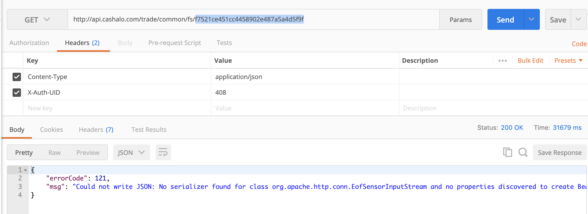

文件上传下载时出现以下错误：

<!-- more -->

经过调查,由于重写了WebMvcConfigurationSupport.configureMessageConverters方法

@Configuration
public class OpenServiceConfig extends WebMvcConfigurationSupport implements ApplicationRunner {

    @Autowired
    private Environment environment;

    private ApiMappingHandlerMapping apiMappingHandlerMapping = new ApiMappingHandlerMapping();

    @Override
    protected RequestMappingHandlerMapping createRequestMappingHandlerMapping() {
        return apiMappingHandlerMapping;
    }

    @Override
    public void run(ApplicationArguments args) {
        ApiMetaManager apiMetaManager = new ServiceZookeeperApiMetaManager(environment);
        RequestMappingEvent requestMappingEvent = new DefaultRequestMappingEvent(apiMetaManager, environment);
        requestMappingEvent.onRegisterSuccess(apiMappingHandlerMapping);
    }

    @Override
    public void configureMessageConverters(List<HttpMessageConverter<?>> converters) {
        converters.clear();
        ObjectMapper objectMapper = new ObjectMapper().setSerializationInclusion(JsonInclude.Include.NON_NULL);
        objectMapper.configure(DeserializationFeature.FAIL_ON_UNKNOWN_PROPERTIES,false);
        converters.add(new MappingJackson2HttpMessageConverter(objectMapper));
    }

    @Override
    protected void addResourceHandlers(ResourceHandlerRegistry registry) {
        registry.addResourceHandler("swagger-ui.html")
                .addResourceLocations("classpath:/META-INF/resources/");

        registry.addResourceHandler("/webjars/**")
                .addResourceLocations("classpath:/META-INF/resources/webjars/");
    }
}


springMVC开始加载转换器的时候会先走用户定制化方法

	protected final List<HttpMessageConverter<?>> getMessageConverters() {
		if (this.messageConverters == null) {
			this.messageConverters = new ArrayList<HttpMessageConverter<?>>();
			configureMessageConverters(this.messageConverters);
			if (this.messageConverters.isEmpty()) {
				addDefaultHttpMessageConverters(this.messageConverters);
			}
			extendMessageConverters(this.messageConverters);
		}
		return this.messageConverters;
	}


如果用户没有定制化，springmvc会使用自定个的7个转换器

	protected final void addDefaultHttpMessageConverters(List<HttpMessageConverter<?>> messageConverters) {
		StringHttpMessageConverter stringConverter = new StringHttpMessageConverter();
		stringConverter.setWriteAcceptCharset(false);

		messageConverters.add(new ByteArrayHttpMessageConverter());
		messageConverters.add(stringConverter);
		messageConverters.add(new ResourceHttpMessageConverter());
		messageConverters.add(new SourceHttpMessageConverter<Source>());
		messageConverters.add(new AllEncompassingFormHttpMessageConverter());

		if (romePresent) {
			messageConverters.add(new AtomFeedHttpMessageConverter());
			messageConverters.add(new RssChannelHttpMessageConverter());
		}

		if (jackson2XmlPresent) {
			messageConverters.add(new MappingJackson2XmlHttpMessageConverter(
					Jackson2ObjectMapperBuilder.xml().applicationContext(this.applicationContext).build()));
		}
		else if (jaxb2Present) {
			messageConverters.add(new Jaxb2RootElementHttpMessageConverter());
		}

		if (jackson2Present) {
			messageConverters.add(new MappingJackson2HttpMessageConverter(
					Jackson2ObjectMapperBuilder.json().applicationContext(this.applicationContext).build()));
		}
		else if (gsonPresent) {
			messageConverters.add(new GsonHttpMessageConverter());
		}
	}


由于项目在自定义的时候没有考虑到文件上传下载这种字节流的解析，导致序列化失败
增加配置解决问题

objectMapper.configure(SerializationFeature.FAIL_ON_EMPTY_BEANS, false);
